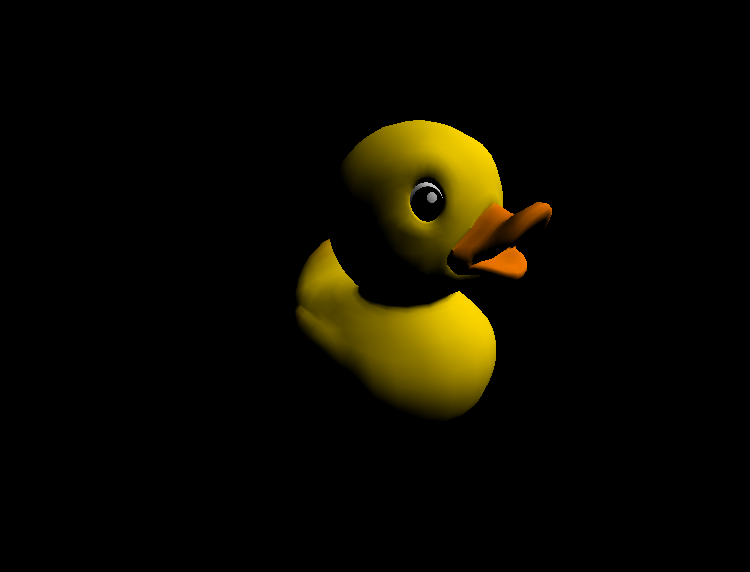

**University of Pennsylvania, CIS 565: GPU Programming and Architecture,
Project 4 - CUDA Rasterizer**

* Josh Lawrence
* Tested on: Windows 10, i7-6700HQ @ 2.6GHz 8GB, GTX 960M 2GB  Personal

**Overview** 
For a detailed overiew of rasterization, cuda mutex, and MSAA see:
https://github.com/ssloy/tinyrenderer/wiki
https://stackoverflow.com/questions/21341495/cuda-mutex-and-atomiccas
https://mynameismjp.wordpress.com/2012/10/24/msaa-overview/

**Highlights** 
    Below are some are some renders of the cuda rasterizer using perspective correct interpolation, textures with bilinear filtering, blinn-phong shading, and MSAA.
 
 
   Of all the steps in software implementation of the grahics pipeline rasterization takes the longest. This is not surprising as the next runner up, fragment shading, is not that complex using only simple shading models like blinn-phong and some texture fetches of a single model, whose global memory latency can be hidden since there are other operations that can be done while it is being fetched. Primitive assembly is the least complicated stage, only there to organize vertices into triangles. Vertex transform and assembly is slightly more complex in that it needs to perform some transformations before it organizes vertex information.
 
 
    The bottle neck in the resterization step is clearly the critical section requiring access to the mutex for a pixel. If there are multiple triangle fragments resolving to a pixel they each must test their depth,and if it's less, get access to the mutex and store the new value. In the worst case this is a serial process in the best case the closest fragment gets it first and the rest don't need to update the depth buffer. The other thing that makes this proccess slow is that it requires cross-block communication and since the depth buffer is a shared resource thread in other blocks must constantly update their copy of the depth buffers state for the pixel they are trying to update. 
 
 
    One thing that can help speed this up is knowing that as soon as you have the mutex, you must release it as fast as possible so others can test and get access if they need to. To do this you can pre-caculate all the attributes of the fragement up front, even knowing that most fragments wont pass; however, this is all a parallel process, while the mutex is not. Doing this saves about 0.7ms of frame time.

 
 
    There was not much savings between software SSAA and MSAA, both needed additional depth buffer slots for the subsamles, additional fragment slots for the subsamples and blending of teh subsamples. I did not really see a difference in implementation details from reading the article, or at least pass one fragment to the fragment shader(render function) to magically blend between the edge of the duck and the black background).
 
 

**Software implementation of GPU pipeline: Renders** 
**Duck Diffuse** 

**Duck Blinn-Phong, gamma correction** 

**Duck SSAA comparison** 

**Checker no tex filtering** 

**Checker bilinear tex filtering, with blinn-phong, gamma correction** 

**Cesium Milk Truck** 

**Data** 

**Time per feature breakdown** 

**MSAA** />

**SSAA** 

**GPU Device Properties** 
https://devblogs.nvidia.com/parallelforall/5-things-you-should-know-about-new-maxwell-gpu-architecture/ 
cuda cores 640 
mem bandwidth 86.4 GB/s 
L2 cache size 2MB 
num banks in shared memory 32 
number of multiprocessor 5 
max blocks per multiprocessor 32 
total shared mem per block 49152 bytes 
total shared mem per MP 65536 bytes 
total regs per block and MP 65536 
max threads per block 1024 
max threads per mp 2048 
total const memory 65536 
max reg per thread 255 
max concurrent warps 64 
total global mem 2G 
 
max dims for block 1024 1024 64 
max dims for a grid 2,147,483,647 65536 65536 
clock rate 1,097,5000 
texture alignment 512 
concurrent copy and execution yes 
major.minor 5.0 

### Credits

* [tinygltfloader](https://github.com/syoyo/tinygltfloader) by [@soyoyo](https://github.com/syoyo)
* [glTF Sample Models](https://github.com/KhronosGroup/glTF/blob/master/sampleModels/README.md)
